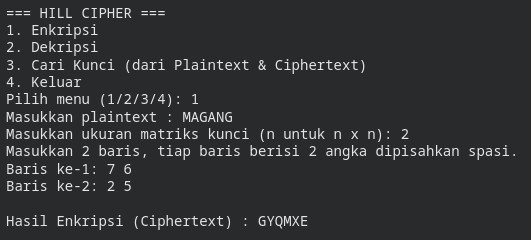

# 🔐 Hill Cipher

Repositori/Program ini berisi implementasi algoritma kriptografi klasik **Hill Cipher** menggunakan bahasa pemrograman Python. Program ini tidak hanya mendukung proses penyandian teks (enkripsi) dan pembalikan sandi (dekripsi), tetapi juga dilengkapi dengan fitur **Known-Plaintext Attack** untuk mencari matriks kunci jika *Plaintext* dan *Ciphertext* diketahui.

## ✨ Fitur

1. **Enkripsi**: Menyandikan teks biasa (*plaintext*) menjadi teks sandi (*ciphertext*) menggunakan matriks kunci `n x n`.
2. **Dekripsi**: Mengembalikan *ciphertext* menjadi *plaintext* asli menggunakan invers matriks kunci modulo 26.
3. **Mencari Kunci (Find Key)**: Menemukan matriks kunci yang digunakan berdasarkan pasangan *plaintext* dan *ciphertext* yang diketahui (memerlukan matriks *plaintext* yang *invertible* modulo 26).
4. **Auto-Padding**: Otomatis menambahkan karakter 'X' di akhir teks jika panjang teks tidak sesuai dengan ukuran matriks (bukan kelipatan `n`).
5. **Menu Interaktif**: Semua input (teks, kunci/matriks) dimasukkan langsung oleh pengguna lewat terminal — tidak ada nilai yang di-*hardcode* di dalam kode program.

## 🛠️ Persyaratan (Requirements)

Program ini menggunakan operasi matriks tingkat lanjut dan aritmatika modular. Pastikan Anda telah menginstal Python (minimal versi 3.6) dan *library* berikut:

* `numpy` (Untuk operasi perkalian matriks)
* `sympy` (Untuk mencari invers matriks modular dengan cepat dan akurat)

**Cara Install Library:**
Buka terminal/Command Prompt dan jalankan:

```bash
pip install numpy sympy

```

## 🚀 Cara Penggunaan

1. Buka terminal atau command prompt, lalu arahkan ke direktori `src`.
2. Jalankan file dengan perintah:
```bash
python hillcipher.py
```
3. Program akan menampilkan menu berikut:
```text
=== HILL CIPHER ===
1. Enkripsi
2. Dekripsi
3. Cari Kunci (dari Plaintext & Ciphertext)
4. Keluar
Pilih menu (1/2/3/4):
```
4. Pilih menu yang diinginkan, lalu ikuti instruksi input yang muncul:
   * **Enkripsi (1)** — masukkan *plaintext*, lalu ukuran matriks kunci `n`, lalu isi matriks kunci baris per baris (angka dipisahkan spasi).
   * **Dekripsi (2)** — masukkan *ciphertext*, lalu ukuran dan isi matriks kunci (sama seperti di atas).
   * **Cari Kunci (3)** — masukkan *plaintext* dan *ciphertext* yang saling berpasangan, lalu ukuran matriks kunci `n` yang ingin dicari.
   * **Keluar (4)** — menutup program.

## 💻 Contoh Output Program

Berikut contoh sesi interaktif saat menjalankan `python hillcipher.py`:



## 📐 Penjelasan Matematis Singkat

Program ini bekerja pada basis alfabet Inggris (A-Z) yang dikonversi menjadi angka (A=0, B=1, ... Z=25).

* **Enkripsi**: `C = K x P (mod 26)`
Di mana `C` adalah vektor matriks *ciphertext*, `K` adalah matriks kunci, dan `P` adalah vektor matriks *plaintext*.
* **Dekripsi**: `P = K^-1 x C (mod 26)`
Di mana `K^-1` adalah invers dari matriks kunci dalam modulo 26. (Catatan: Tidak semua matriks memiliki invers mod 26. Determinan matriks `K` harus *coprime* / relatif prima dengan 26).
* **Mencari Kunci**: `K = C x P^-1 (mod 26)`
Jika kita memiliki blok teks yang cukup untuk membuat matriks bujursangkar, kita dapat mencari invers dari matriks *plaintext* (`P^-1`) lalu mengalikannya dengan matriks *ciphertext* untuk mendapatkan matriks kunci (`K`).

## ⚠️ Catatan / Limitasi

* Fungsi pencarian kunci (`find_key_hill`) bisa gagal dan memunculkan *error* `ValueError` jika bagian dari Plaintext yang diambil membentuk matriks yang determinannya **tidak relatif prima terhadap 26** (sehingga tidak memiliki invers). Jika ini terjadi pada kasus nyata, solusinya adalah mengambil blok huruf (karakter) di posisi lain dari teks untuk membentuk matriks.