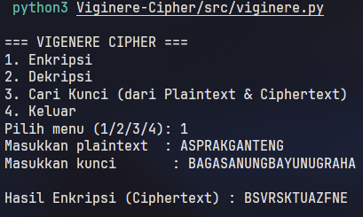

# 🔐 Vigenere Cipher

Repositori/Program ini berisi implementasi algoritma kriptografi klasik **Vigenere Cipher** menggunakan bahasa pemrograman Python. Program ini mendukung proses penyandian teks (enkripsi) dan pembalikan sandi (dekripsi), serta dilengkapi dengan fitur untuk **mencari kunci** jika *Plaintext* dan *Ciphertext* (dengan panjang yang sama) diketahui.

## ✨ Fitur

1. **Enkripsi**: Menyandikan teks biasa (*plaintext*) menjadi teks sandi (*ciphertext*) menggunakan sebuah kata kunci (*key*) yang diulang sepanjang teks.
2. **Dekripsi**: Mengembalikan *ciphertext* menjadi *plaintext* asli menggunakan kunci yang sama.
3. **Mencari Kunci (Find Key)**: Menemukan aliran kunci (*key stream*) yang digunakan berdasarkan pasangan *plaintext* dan *ciphertext* yang diketahui (harus memiliki panjang yang sama).
4. **Auto-Cleaning**: Otomatis mengubah teks menjadi huruf kapital dan menghapus karakter selain A-Z (spasi, tanda baca, angka, dll) sebelum diproses.
5. **Menu Interaktif**: Semua input (plaintext/ciphertext/kunci) dimasukkan langsung oleh pengguna lewat terminal — tidak ada nilai yang di-*hardcode* di dalam kode program.

## 🛠️ Persyaratan (Requirements)

Program ini hanya menggunakan modul standar Python (`re`), sehingga tidak memerlukan instalasi *library* tambahan.

Pastikan Anda telah menginstal Python minimal versi 3.6.

## 🚀 Cara Penggunaan

1. Buka terminal atau command prompt, lalu arahkan ke direktori `src`.
2. Jalankan file dengan perintah:

```bash
python viginere.py
```
3. Program akan menampilkan menu berikut:
```text
=== VIGENERE CIPHER ===
1. Enkripsi
2. Dekripsi
3. Cari Kunci (dari Plaintext & Ciphertext)
4. Keluar
Pilih menu (1/2/3/4):
```
4. Pilih menu yang diinginkan, lalu ikuti instruksi input yang muncul:
   * **Enkripsi (1)** — masukkan *plaintext* dan kunci.
   * **Dekripsi (2)** — masukkan *ciphertext* dan kunci.
   * **Cari Kunci (3)** — masukkan *plaintext* dan *ciphertext* yang saling berpasangan (panjang harus sama).
   * **Keluar (4)** — menutup program.

## 💻 Contoh Output Program

Berikut contoh sesi interaktif saat menjalankan `python viginere.py`:



## 📐 Penjelasan Matematis Singkat

Program ini bekerja pada basis alfabet Inggris (A-Z) yang dikonversi menjadi angka (A=0, B=1, ... Z=25).

* **Enkripsi**: `Ci = (Pi + Ki) mod 26`
  Di mana `Pi` adalah huruf plaintext ke-`i`, dan `Ki` adalah huruf kunci ke-`i` (kunci diulang sesuai panjang teks).
* **Dekripsi**: `Pi = (Ci - Ki) mod 26`
  Di mana `Ci` adalah huruf ciphertext ke-`i`.
* **Mencari Kunci**: `Ki = (Ci - Pi) mod 26`
  Jika plaintext dan ciphertext (dengan panjang yang sama) diketahui, kunci pada setiap posisi dapat dihitung secara langsung.

## ⚠️ Catatan / Limitasi

* Fungsi `find_key_vigenere` mengembalikan *key stream* sepanjang teks yang diberikan, bukan periode kunci terpendeknya. Jika ingin mengetahui kunci asli yang lebih singkat (misalnya "KUNCI" dari "KUNCIKUNCI..."), Anda perlu memeriksa pola perulangan pada hasil *key stream* tersebut secara manual.
* Kunci hanya boleh berisi huruf (non-alfabet pada kunci akan dihapus otomatis), dan tidak boleh kosong.
